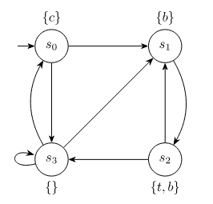

# modelcheck
Robust model checker for a proposition in [CTL](https://en.wikipedia.org/wiki/Computation_tree_logic).

In other words, given a model M and a proposition p, the program checks if M |= p.

## Example
We define a model as follows
```
let S {s0,s1,s2,s3};
let I {s0};

label s0 {c};
label s1 {b};
label s2 {t,b};
label s3 nil;

transition s0 {s1,s3};
transition s1 {s2};
transition s2 {s1,s3};
transition s3 {s0,s1,s3};
```
This represents the following model:



Then, if p = E[~c U (b ^ ~t)], Sat(p) = {s1}. So, M |/= p
