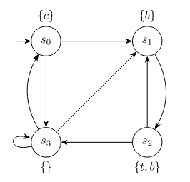

# modelcheck
Robust model checker for a formula in [CTL](https://en.wikipedia.org/wiki/Computation_tree_logic).

In other words, given a model M and a formula phi, the program checks if M |= phi.

## Getting started
```
$ git clone https://github.com/lauchimoon/modelcheck
$ cargo build
$ ./target/debug/modelcheck <model file> <formula>
```

### Models
Models need states and initial states. Those states have labels and transitions.

To see a defined model, check [the example](#Example)

### Formulas
Formulas have the following grammar:
```
phi ::= 0 | 1 | p | ~phi | !phi | phi ^ phi | phi v phi | phi V phi |
         phi -> phi | AXphi | EXphi | AFphi | EFphi | AGphi | EGphi |
         A[phi U phi] | E[phi U phi]
```
So for example, a formula could look like `A[(c ^ t) U ~(E[c U c] -> 0)]`
- `~phi` and `!phi` are equivalent. So `~(c ^ t) == `!(c ^ t)`
- `phi v phi` and `phi V phi` are equivalent. So `c v t == `c V t`

## Example
We define a model as follows
```
let S {s0, s1, s2, s3};
let I {s0};

label s0 {c};
label s1 {b};
label s2 {t, b};
label s3 nil;

transition s0 {s1, s3};
transition s1 {s2};
transition s2 {s1, s3};
transition s3 {s0, s1, s3};
```
This represents the following graph:



Then, if phi = `E[~c U (b ^ ~t)]`, Sat(phi) = `{s1, s2, s3}`. So, M |/= phi
